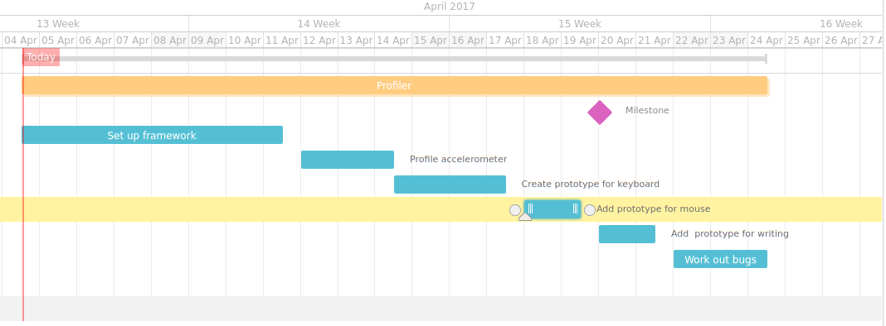
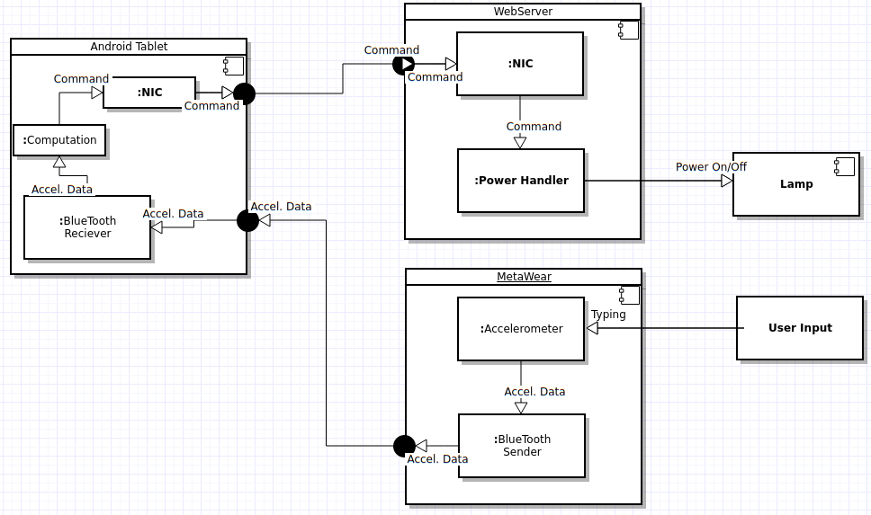

## CYBR 8480 Project

### Executive Summary
The original idea revolved around trying to create a keylogger using the accelerometer in my mbientlab device. After putting some thought into it, that turned out to be way beyond the scope. So it was decided that I would attempt to create a device that would detect whether a person was typing, writing, or using a mouse. The goal is currently just to get to the point where I would be able to accurately determine which of these were happening. If this goal comes easier than imagined, the project would pivot to either trying to detect more things, and/or creating a nice graphical interface for a user. This could potentially be very useful in an intelligence community because it would allow for the profiling of the person being watched. Granted, knowing what they are typing or writing is much more handy, but at least this is a start. 

Honestly, this does not really help anyone except for myself for now. This is a good learning experience and I am going to use it as such. The project is interesting because it allows myself (and potentially others) to dip their toes in the water and take the first steps to using an accelerometer for more interesting activities. That being said, it very well could be taken to the next level using AI to try to figure out what a user is doing inside each of the major categories I defined. These could be called sub-categories and would boil down to activities such as what the user is typing and where the mouse is going. That is when this information becomes incredibly useful to either someone watching their own desk, or an adversary trying to sniff out information. 

#### Goals
1. Program device to sit on a desk and send data back to a phone
1. Program a phone to receive data and show output to user
1. Determine if a user is typing
1. Determine if a user is writing
1. Determine if a user if using the mouse (mousing?)

### Project Breakdown

### Risk Table
|Risk name (value)  | Impact     | Likelihood | Description | Mitigation |
|-------------------|------------|------------|-------------|------------|
|Accelerometer too sensitive (32) | 4 | 8 | Accelerometer could pick up too much noise and make it really hard to determine what signal we want and what signal we should cut out. | Try to eliminate outliers in the data, smooth out the waves, and go from there. |
|Accelerometer not sensitive enough (32) | 4 | 8 | Accelerometer could pick up nothing dependent on the type of keyboard, type of desk, and what the desk is sitting on. | Experiment with different environments and move the accelerometer closer to the keyboard. |
|Device could be DOA (8) | 8 | 1 | My accelerometer could be dead on arrival, which would set my timeline back about a week. | Buy a new device and attempt to borrow one while I am waiting for my new device to ship. |
|My javascript skills are inept (32) | 8 | 4 | My comfortability around javascript is relatively low, so programming the phone to do what I want might be a challenge at times. | The migration would be to "try harder" and put more time into it. |
|Time could run short (30) | 6 | 5 | I am not going to have as much time to devote to this project as I would like to. I very well could run out of time to work on the project and polish it the way I would like to. | Accept the risk. |

### Application Requirements
#### User Stories
1. As a computer user, I want to know if someone else is typing on my keyboard so I can go about finding who it was. 

	* Acceptance criteria includes getting the keyboard prototype to work and relaying that information to the phone.

2. As a intelligence official, I want to know what my target is doing at their desk so that I can better profile the user.

	* Acceptance criteria includes building out the three prototypes and getting them to work nicely together.

3. As a boss, I would like to know if my employees are actually working so that I can tell how much time they kill talking or looking at their phones. 

	* Acceptance criteria includes build out an overall time counter to determine how long the person was doing such an activity.

#### Misuser Stories
1. As a misuser, I want to throw off the sensor by pounding on the desk so that it can not track my activities as easily.

	* Counter to this would be to remove outliers in data.

2. As a misuser, I want to sniff the data sent to the phone to try to gleam valuable information so that I can continue my attack on my target.

	* Counter to this would be to either encrypt the data in some manner before sending it across, or simply do not send valuable information.

### Architectural Diagram

* User Input
	* Any Z(Up and Down) motion made by the user
* MetaWear
	* Takes in input to the Accelerometer
	* Sends Accelerometer Data via Bluetooth to the Android Tablet
* Android Table
	* Receives Accelerometer Data via Bluetooth
	* Computes Data and either does nothing or sends a command to the webserver via Wireless
* Webserver
	* Receives Command via Wireless
	* Decides whether or not to turn the power on
* Lamp
	* Turns On/Off dependent on if there is any electricity flowing to it

### MileStone2 Slides
[MileStone2](https://docs.google.com/a/unomaha.edu/presentation/d/1KU3k5oo_3gfoYH_ApWfizyJg5P5Qq1u6vHYiD63HEP4/edit?usp=sharing)

### Requirements
#### Hardware
[Metawear R](https://mbientlab.com/product/metawearr/)
Android [Version >=6.0.1]
Computer

#### Software
* Arch Linux installation [If using another distribution, modify the setup.sh script]
* ADB (Android Debug Bridge)
	* `Pacman -S android-tools`
* Android Studio setup (Properly w/enviroment variables set)
	* [Tutorial Here](https://developer.android.com/studio/install.html)
* Android SDK installed (Again, properly)
	* [Tutorial Here](http://www.androidcentral.com/installing-android-sdk-windows-mac-and-linux-tutorial)
* Java SDK
	* [Arch Wiki Here](https://wiki.archlinux.org/index.php/java)
* Npm **(Handled by setup.sh)**
	* cordova
	* ember-cli
		* ember-cordova
		* ember-charts
		* ember-bootstap
* Bower **(Handled by setup.sh)**
* Plugins: **(Handled by setup.sh)**
	* cordova-plugin-device-motion
	* https://github.com/mbientlab-projects/MetaWearCordova-Plugin

### Installation
If required pre-reqs met above, running ./setup.sh as an unpriv user with sudo access in this directory should be sufficient.

### Getting Started
Connect the android device and confirm it is able to be talked to via adb. Turn on allowing apps from somewhere other than the Play store to be installed. Change the MAC address in "app/components/lamp-display.js", it is currently set to DA:88:BB:64:7B:CB. Run the command ./run.sh.
